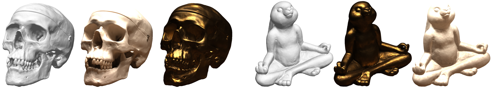

# Multiview Neural Surface Reconstruction <br> by Disentangling Geometry and Appearance

### [Project Page](https://lioryariv.github.io/idr/) | [Paper](https://arxiv.org/abs/2003.09852) | [Data](https://www.dropbox.com/sh/5tam07ai8ch90pf/AADniBT3dmAexvm_J1oL__uoa)

<p align="center">
  
</p>

This repository contains an implementation for the NeurIPS 2020 paper <a href="https://arxiv.org/abs/2003.09852">Multiview Neural Surface Reconstruction by Disentangling Geometry and Appearance</a>.

The paper introduce Implicit Differentiable Renderer (IDR): a neural network architecture that simultaneously learns the 3D geometry, appearance and cameras from a set of 2D images.
IDR able to produce high fidelity 3D surface reconstruction, by disentangling geometry and appearance, learned solely from masked 2D images and rough camera estimates.


## Installation Requirmenets
The code is compatible with python 3.7 and pytorch 1.2. In addition, the following packages are required:  
numpy, pyhocon, plotly, scikit-image, trimesh, imageio, opencv, torchvision.

You can create an anaconda environment called `idr` with the required dependencies by running:
```
conda env create -f environment.yml
conda activate idr
```

## Usage
### Multiview 3D reconstruction
#### Data
We apply our multiview surface reconstruction model to real 2D images from the <a href="http://roboimagedata.compute.dtu.dk/?page_id=36" target="_blank">DTU MVS repository</a>. 
The 15 scans data, including the manually annotated masks and the noisy initializations for the trainable cameras setup, can be download using:
```
bash data/download_data.sh 
```
For more information on the data convention and how to run IDR on a new data please have a look at <a href="https://github.com/lioryariv/idr/blob/main/DATA_CONVENTION.md">data convention</a>.<br><br>

We used our method to generate 3D reconstructions in two different setups:
#### Training with fixed ground truth cameras
For training IDR run:
```
cd ./code
python training/exp_runner.py --conf ./confs/dtu_fixed_cameras.conf --scan_id SCAN_ID
```
where SCAN_ID is the id of the DTU scene to reconstruct.

Then, to produce the meshed surface, run:
```
cd ./code
python evaluation/eval.py  --conf ./confs/dtu_fixed_cameras.conf --scan_id SCAN_ID --checkpoint CHECKPOINT [--eval_rendering]
```
where CHECKPOINT is the epoch you wish to evaluate or 'latest' if you wish to take the most recent epoch.
Turning on `--eval_rendering` will further produce and evaluate PSNR of train image reconstructions.


#### Training with trainable cameras with noisy initializations
For training IDR with cameras optimization run:
```
cd ./code
python training/exp_runner.py --train_cameras --conf ./confs/dtu_trained_cameras.conf --scan_id SCAN_ID
```

Then, to evaluate cameras accuracy and to produce the meshed surface, run:
```
cd ./code
python evaluation/eval.py  --eval_cameras --conf ./confs/dtu_trained_cameras.conf --scan_id SCAN_ID --checkpoint CHECKPOINT [--eval_rendering]
```


#### Evaluation on pretrained models

We have uploaded IDR trained models, and you can run the evaluation using:
```
cd ./code
python evaluation/eval.py --exps_folder trained_models --conf ./confs/dtu_fixed_cameras.conf --scan_id SCAN_ID  --checkpoint 2000 [--eval_rendering]
```
Or, for trained cameras:
```
python evaluation/eval.py --exps_folder trained_models --conf ./confs/dtu_trained_cameras.conf --scan_id SCAN_ID --checkpoint 2000 --eval_cameras [--eval_rendering]
```


### Disentanglement of geometry and appearance

<p align="center">
  
</p>


For transferring the appearance learned from one scene to unseen geometry, run:

```
cd ./code
python evaluation/eval_disentanglement.py --geometry_id GEOMETRY_ID --appearance_id APPEARANCE _ID
```

This script will produce novel views of the geometry of the `GEOMETRY_ID` scan trained model, and the rendering of the `APPEARANCE_ID` scan trained model.

## Citation
If you find our work useful in your research, please consider citing:

	@article{yariv2020multiview,
	title={Multiview Neural Surface Reconstruction by Disentangling Geometry and Appearance},
	author={Yariv, Lior and Kasten, Yoni and Moran, Dror and Galun, Meirav and Atzmon, Matan and Ronen, Basri and Lipman, Yaron},
	journal={Advances in Neural Information Processing Systems},
	volume={33},
	year={2020}
	}
	
	
## Related papers
Here are related works on implicit neural representation from our group:
* [Gropp et al. - Implicit Geometric Regularization for Learning Shapes (2020)](https://arxiv.org/abs/2002.10099)
* [Atzmon & Lipman. - SAL++: Sign Agnostic Learning with Derivatives (2020)](https://arxiv.org/abs/2006.05400)
* [Atzmon & Lipman. - SAL: Sign Agnostic Learning of Shapes From Raw Data (2020)](https://arxiv.org/abs/1911.10414)
* [Atzmon et al. - Controlling Neural Level Sets (2019)](https://arxiv.org/abs/1905.11911)
